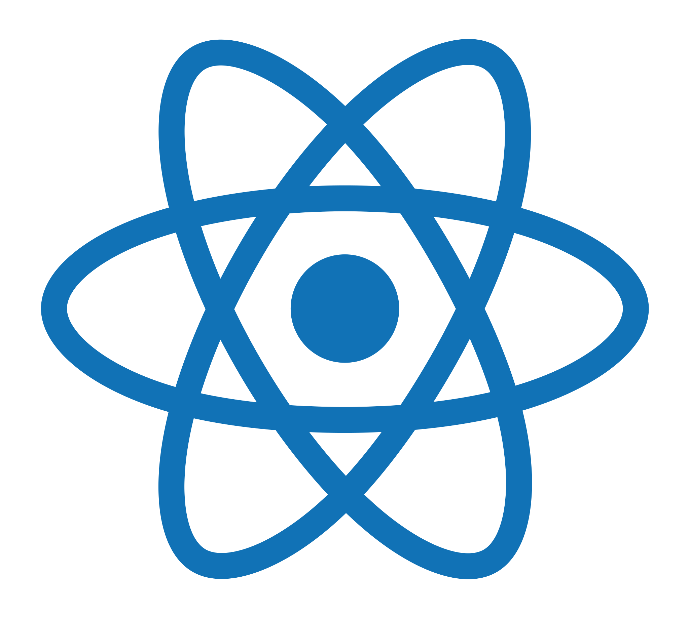

<h1 align="center">Trilha React Desafio 1 - Todo List</h1>

  
  

  Primeiro desafio da trilha ReactJs do curso Ignite, desenvolvido com objetivo de reforçar os conceitos da biblioteca apresentado no primeiro módulo tendo como principal foco os temas de estado, imutabilidade de estado, propriedades e componentização. 

## Apresentação

<h4 align="center">Tela inicial</h4>

  

 
<h4 align="center">Lista vazia</h4>

  

## Executando o Projeto
Para executar o projeto você precisa ter instalado o NPM ou o Yarn em sua máquina, em seguida, abra o terminal e execute os seguintes comandos:
1. Clone o projeto: `git clone https://github.com/matheusmaximianomv/desafio01-todo-list`
2. Instale as dependências:
 Usando NPM `npm install`
 Usando o Yarn `yarn`, caso tenha instalado.
3. Execute o projeto:
 Usando NPM `npm run dev`
 Usando o Yarn `yarn dev`, caso tenha instalado.
4. O App estará executando em http://localhost:3000